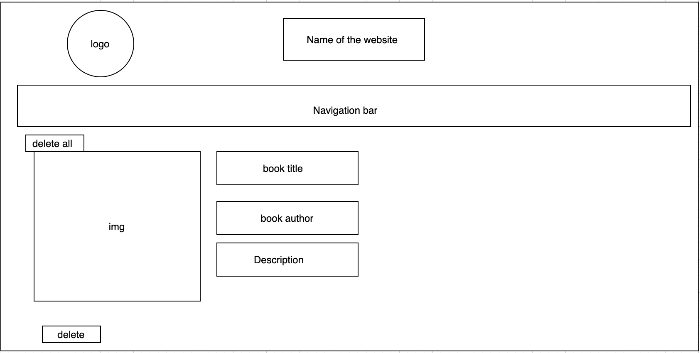

## Overview:

Book website is a website show books in different fields and show the Best Sellers , also add new books and add to favorite to save it in same list.

## Book Website Link :
https://amirahalmani.github.io/project-2/

## List of technologies used in this project:

<li>React
<li>css
<li>axios
<li>router

## User Story :

<li>User csn represent books when he/she click on tha navigation bar .
<li>User can add books to favorite list to save it in same place .
<li>User can delete one or more book from favorite .
<li>User can add books and delete books.
<li>User can show websites in different devices (Responsive).

## API:

I use The New York Times to represent Best Sellers lists.

## Wireframes:

### Home page:

### Book page:

### Best Sellers page :

### Search page :

### Fave page:

### Home page:

### Books page:

### Best Sellers page :

### Search page:

### Add Books page :

## Development process and problem-solving strategy:

<li>Idea and plan
<li>Create structur of website
<li>Create React App
<li>create components
<li>Add informations and API
<li>create functions
<li> CSS and Design 

## Future improvements:

<li>Add login page and no one can add books or delete from database only admin .
<li>improve css
